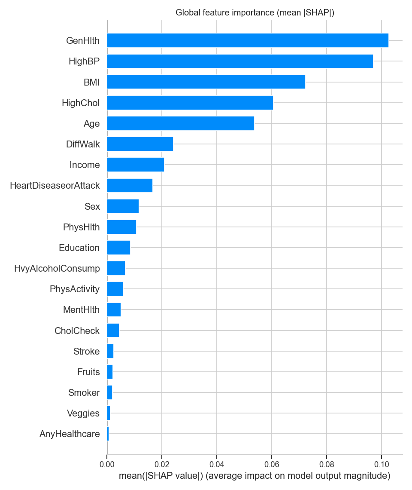
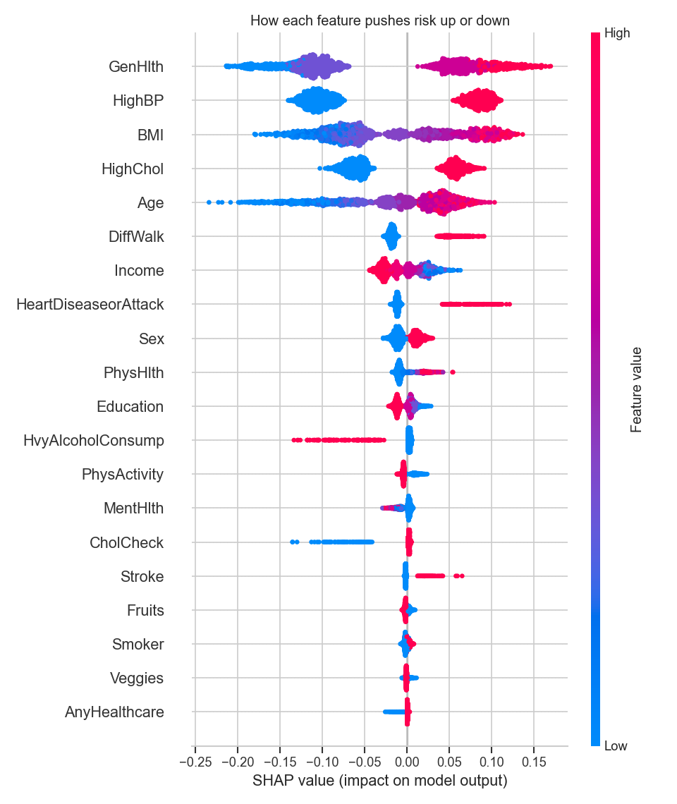

# Diabetes Risk Prediction (with Explainable AI)

A machine-learning project that predicts an individual's risk of diabetes from
routine health and lifestyle indicators, then **explains every prediction** with
SHAP. Built on the CDC's BRFSS survey of **253,680 US adults**.

> **Why it matters:** a screening model is only useful in healthcare if clinicians
> can *trust and interpret* it. This project goes beyond accuracy — it handles
> class imbalance honestly, checks probability calibration, and uses SHAP to show
> exactly which factors drive each person's risk.

---

## 📊 Results

| Model | ROC-AUC | PR-AUC |
|---|---|---|
| Logistic Regression (baseline) | 0.822 | 0.397 |
| **Random Forest** (best) | **0.827** | **0.421** |

At a recall-tuned decision threshold (0.61), the model **flags ~62% of true
diabetes cases** — useful for a screening tool, where missing a case is costlier
than a false alarm.

*Diabetes prevalence in the data is ~14%, so the model is evaluated with
**PR-AUC** (0.42 vs. a 0.14 random baseline), **calibration**, and a recall-focused
threshold — not accuracy, which is misleading on imbalanced data.*

### What the model learned (SHAP)



The strongest drivers of predicted risk are general health, high blood pressure,
BMI, age, and high cholesterol — consistent with the clinical literature, which is
a good sign the model is learning real signal rather than noise.

---

## 🎯 What this project demonstrates

- **End-to-end ML workflow** — data → EDA → modelling → evaluation → explainability.
- **Honest evaluation on imbalanced data** — PR-AUC, calibration curve, and a
  deliberately chosen decision threshold (not the naive 0.5).
- **Explainable AI (SHAP)** — global drivers *and* per-patient explanations.
- **Responsible framing** — clear statement of what the model can and can't be used for.
- **Reproducibility** — one script regenerates every figure and metric.

## 🗂️ Repository structure

```
diabetes-risk-prediction/
├── analysis.py                 # full pipeline: load -> EDA -> model -> SHAP
├── data/
│   └── diabetes_health_indicators.csv   # CDC BRFSS 2015 (253,680 rows, 21 features)
├── outputs/                    # all generated figures + metrics.json
└── README.md
```

## 📦 The data

**CDC Diabetes Health Indicators (BRFSS 2015)** — 253,680 survey responses, 21
features (e.g. HighBP, BMI, GenHlth, Age, PhysActivity, Smoker), binary diabetes
target. Source: [UCI ML Repository #891](https://archive.ics.uci.edu/dataset/891/cdc+diabetes+health+indicators).

## 🔁 Reproduce it

```bash
pip install pandas numpy scikit-learn matplotlib seaborn shap ucimlrepo
python analysis.py        # writes all figures + metrics.json to ./outputs
```

## ⚠️ Responsible-use note

This is a **screening / educational** model trained on self-reported survey data.
It is **not a diagnostic tool** and must not be used for individual medical
decisions. Predictions reflect statistical association, not causation, and survey
data carries reporting and sampling biases.

## 🛠️ Tools

Python · pandas · scikit-learn · SHAP · matplotlib / seaborn

## 👤 Author

**Kingsley Amegah** — Health Data Scientist · GitHub: [@Kingsley-amg](https://github.com/Kingsley-amg)
